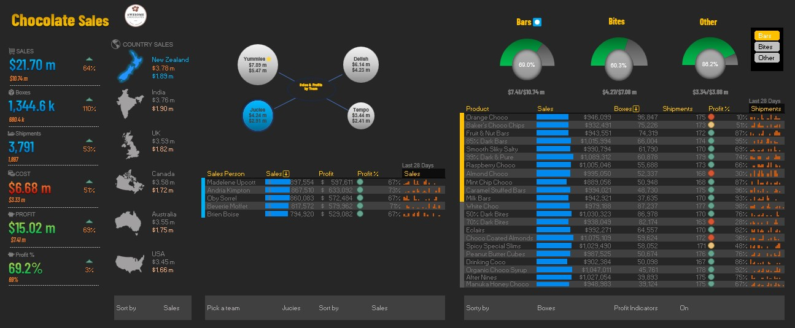

# Excel-Interactive-Dashboard
Analyzing sales of a chocolate company. Learnt from YouTube. 🍫 Excited to share my latest excel data visualization project with you all! 🌍📈

📊 I recently created a comprehensive sales analysis dashboard for a chocolate company, and it was an incredible learning experience.

🎯 With the help of YouTube tutorials, I've learned a wide range of valuable skills to bring this dashboard to life:

🎨 First and foremost, I delved into the art of picking colors, themes, and formats that resonated with the brand's identity, resulting in an engaging and visually appealing dashboard.

🔢 Utilizing powerful tools like Data model, Power Pivot, and DAX, I was able to crunch numbers and calculate essential values that provided valuable insights into the company's sales performance.

📊 Creating and formatting KPI tiles using the TEXT formula allowed me to highlight key metrics and ensure that critical information stood out at a glance.

🗺️ To enhance the geographical understanding of sales, I set up interactive maps using dynamic picture links. Users can now explore sales trends based on different locations effortlessly.

📊 The inclusion of custom charts, such as bubble and donut charts, allowed me to present complex sales data in a visually compelling manner, making it easier for stakeholders to grasp the information.

🔀 To create dynamic tables that adapt to changing data, I harnessed the power of formulas like FILTER, SORT, and SORTBY, enabling users to interact with the data and obtain specific insights.

🎨 Applying conditional formatting rules was crucial in making the tables visually appealing, adding a touch of elegance to the overall design of the dashboard.

📈 I incorporated sparklines to showcase insights and trends, enabling stakeholders to quickly identify patterns and make data-driven decisions.

🔄 Adding sort options with data validation provided users with flexibility in exploring the data, empowering them to focus on specific aspects of the sales analysis.

🔀 Lastly, I integrated slicers to deliver an interactive dashboard experience. This allows users to dynamically filter and analyze data based on geographical area, sales teams, and products.

🌟 The creation of this dashboard not only enhanced my technical skills but also provided me with a deeper understanding of the chocolate company's sales performance. I am excited to leverage these newfound abilities in future projects and continue refining my data visualization expertise.

#DataVisualization #SalesAnalysis #DataAnalytics #excel #data

